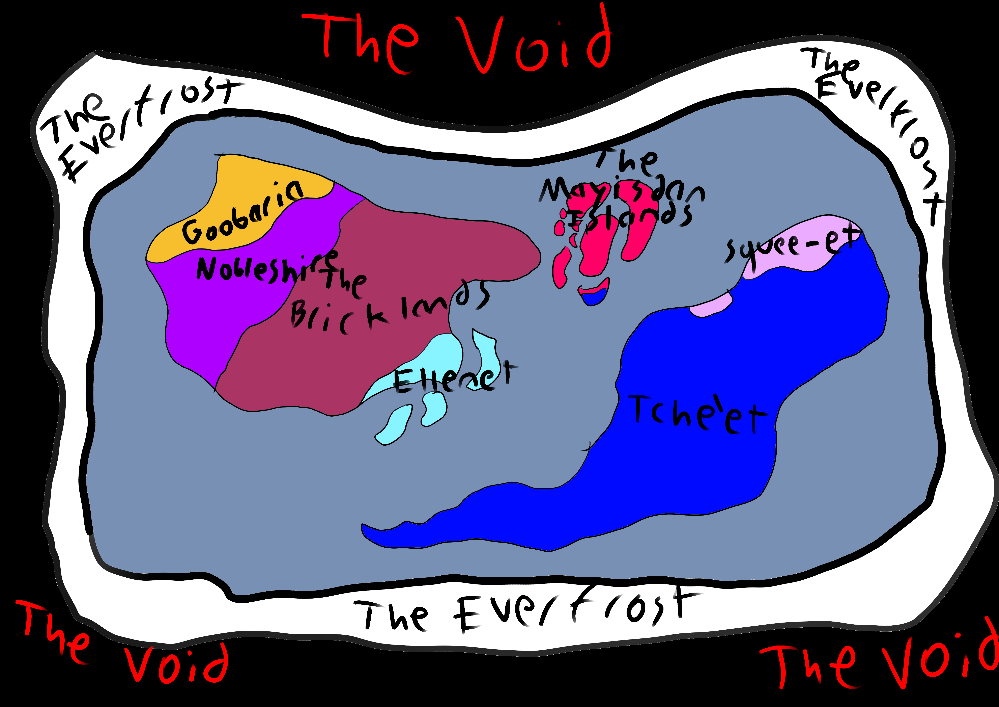

layout: page
title: "https://noiful.github.io/wiki"
permalink: /wiki

<!DOCTYPE html>
<html>
<title>Noiful-Planeth</title>
<meta name="viewport" content="width=device-width, initial-scale=1">
<link rel="stylesheet" href="https://www.w3schools.com/w3css/5/w3.css">
<body>

<a href="index.html" class="w3-bar-item w3-button">Home</a>

Races

    <a href="Humans.html" class="w3-bar-item w3-button">Humans</a>
    <a href="Arcanians.html" class="w3-bar-item w3-button">Arcanians</a>
    <a href="Zhesh.html" class="w3-bar-item w3-button">Zhesh</a>
    <a href="Ekish.html" class="w3-bar-item w3-button">Ekish</a>
    <a href="Analog.html" class="w3-bar-item w3-button">The Analog</a>
    

Locations

    <a href="The Bricklands.html" class="w3-bar-item w3-button">The Bricklands</a>
    <a href="Nobleshire.html" class="w3-bar-item w3-button">Nobleshire</a>
    <a href="Ellenet.html" class="w3-bar-item w3-button">Ellenet</a>
    <a href="Mayisda.html" class="w3-bar-item w3-button">The Mayisdan Islands</a>
    <a href="Squee-et.html" class="w3-bar-item w3-button">Squee-et</a>
    <a href="Tche'et.html" class="w3-bar-item w3-button">Tche'et</a>
    <a href="Goobaria.html" class="w3-bar-item w3-button">Goobaria</a>
    <a href="Everfrost.html" class="w3-bar-item w3-button">The Everfrost</a>
    <a href="Void.html" class="w3-bar-item w3-button">The Void</a>
    

 

    <h2>Welcome to the Noiful-Planeth index!</h2>
    

</body>
</html>
